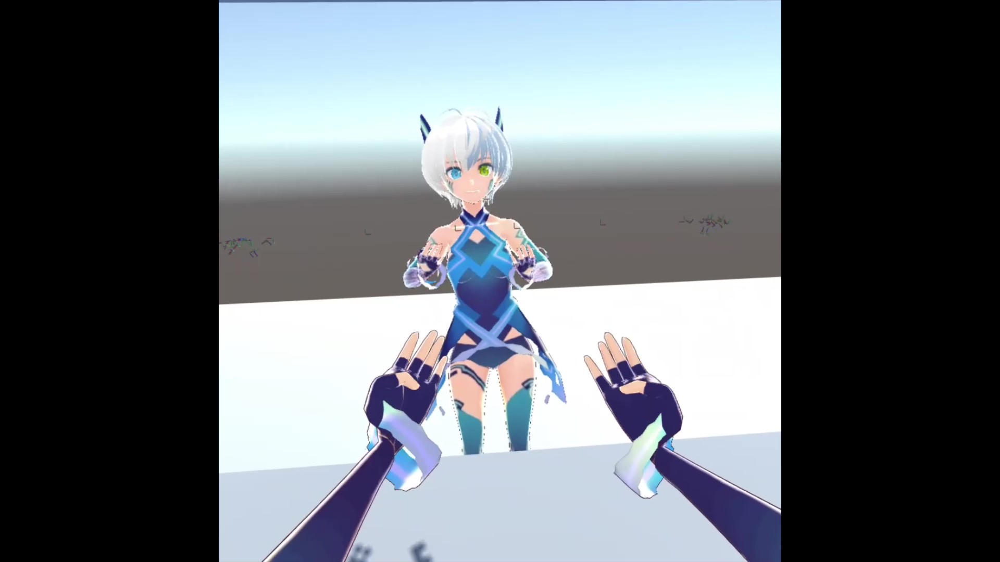
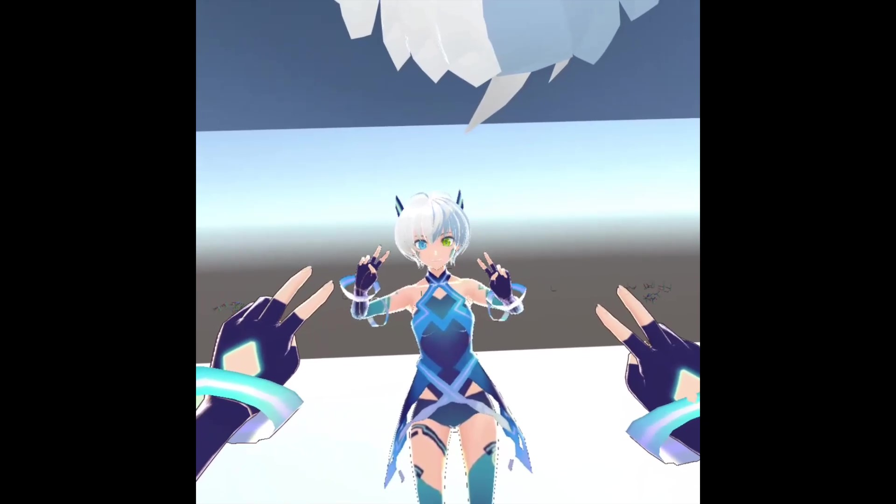
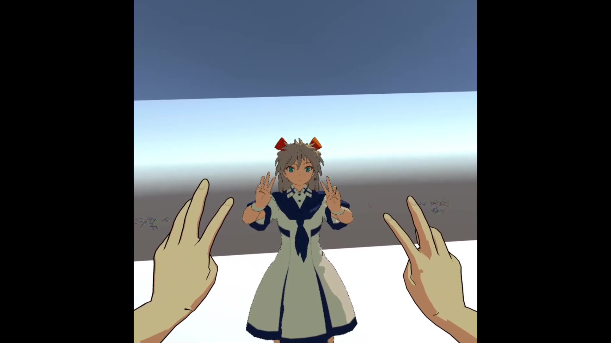
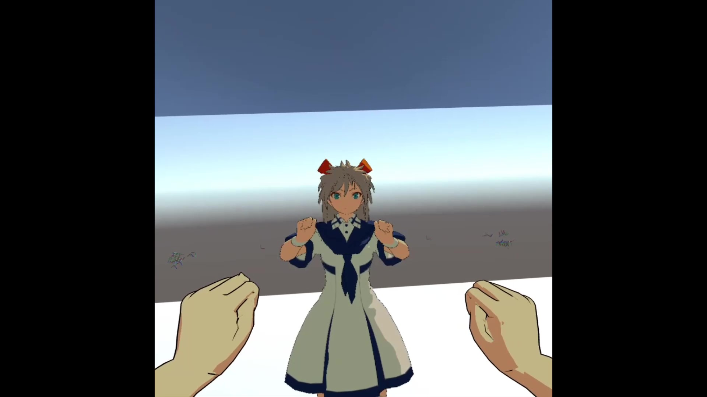

# HandPoseTransferForOculusQuest

Oculus Quest Hand Tracking and Humanoid Avatar Hand Pose Control

[Watch on YouTube](https://youtu.be/Es2NH0OwGS0)

## Tested Environment
- Unity 2018.4.28f1
- Oculus Integration 20.1
- Oculus Quest (Runtime version: 20.0)

## License
このプロジェクトは、サードパーティのアセットを除き、MIT Licenseでライセンスされています。  
This project is licensed under the MIT License excluding third party assets.

## Third party assets
以下のアセットをインポートする必要があります。  
You need to import the following assets.
- [Oculus Integration 20.1](https://developer.oculus.com/downloads/package/unity-integration-archive/20.1/)

このプロジェクトには、以下のアセットが含まれています。  
The following assets are included in this project.
- [UniTask 2.0.36](https://github.com/Cysharp/UniTask/releases/tag/2.0.36)  
Licensed under the MIT License. Copyright (c) 2019 Yoshifumi Kawai / Cysharp, Inc.

- [XR Mecanim IK Plus](http://chobi-glass.com/Unity/XR_MecanimIKPlus.html)  
Copyright (c) 2017 Chobi (@chobi_luck).

- [UniVRM v0.55](https://github.com/vrm-c/UniVRM/releases/tag/v0.55.0)  
Licensed under the MIT License.  
Copyright (c) 2018 DWANGO Co., Ltd. for UniVRM.  
Copyright (c) 2018 ousttrue for UniGLTF, UniHumanoid.  
Copyright (c) 2018 Masataka SUMI for MToon.  

このプロジェクトには、以下のキャラクターモデルが含まれています。  
The following character models are included in this project.
- [School Costume Unity-chan from The Phantom Knowledge. (Humanoid Edition)](http://unity-chan.com/download/download.php?id=TPK-Hmnd-Kohaku_B&v=1.1)  
Licensed under the UCL2.0. (c) Unity Technologies Japan/UCL. 

- [Vita](https://hub.vroid.com/characters/6193066630030526355/models/3525604181073039892)  
This character model can be downloaded from [VRoid Hub](https://hub.vroid.com/).
